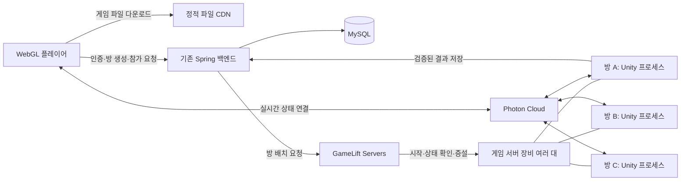

# 동접 100~200명 서버 구조와 최적화 계획

작성: 2026-09-14. 대상: 현재 Unity 6000.3.22f1 / Photon Fusion 2.1.2 게임. 초기 한국 이용자, 방 최대 6명, 로비에서도 캐릭터가 움직이고 같은 방에서 재경기하는 형태를 기준으로 한다. 이 문서는 설계 제안이며 서버 구매·유료 서비스 신청·운영 전환을 실행한 결과가 아니다.

## 추천 결정

**Photon Fusion Server Mode를 유지하고, 방 하나를 Linux Unity 프로세스 하나로 격리한다. 한 장비에는 여러 방을 배치하고, 장비 수를 늘려 확장한다.** 공개 운영의 방 배치·프로세스 복구·자동 증설은 AWS GameLift Servers의 관리형 컨테이너 fleet를 우선 후보로 둔다. 기존 EC2는 당장의 시험 환경과 백엔드 운영에 활용하고, 공개 운영의 게임 연산은 별도 게임 전용 fleet로 분리한다.

여기서 프로세스는 실행 중인 게임 서버 프로그램 하나이고, 컨테이너는 그 프로그램의 실행 환경과 자원 한도를 묶는 단위다. **방 하나마다 EC2 한 대를 사는 구조가 아니다.** GameLift는 여러 게임 서버를 한 EC2에 배치하고 EC2 수를 조절하는 기능을 제공한다. [AWS 컨테이너 fleet 구조](https://docs.aws.amazon.com/gameliftservers/latest/developerguide/containers-howitworks.html)

Multi-Peer는 이 구조를 대신하는 필수 기능이 아니라, 나중에 한 프로세스에 방 여러 개를 넣을지 판단하는 추가 최적화다. 현재는 방 상태·씬·물리·종료를 분리하는 비용과 장애 영향이 절감 효과보다 먼저 발생한다. 따라서 **초기 기본값은 1방=1프로세스**, 측정으로 이득이 입증되면 일부 worker에서 2방 Multi-Peer를 비교한다.

## 전체 구성

그림의 GameLift는 서버 배치·실행 관리 경로다. 게임 패킷을 Spring이나 GameLift API로 중계하지 않는다. 지금 사용 중인 WebGL의 Photon 연결 경로를 유지한다. Fusion Server Mode에는 게임을 실행하는 외부 컴퓨트와 Photon Cloud가 함께 필요하며 Photon도 GameLift를 가능한 호스팅 제공자로 안내한다. [Photon 전용 서버 구조](https://doc.photonengine.com/fusion/v2/concepts-and-patterns/dedicated-server-overview)

각 부분의 책임은 다음처럼 고정한다.

| 구성 | 책임 | 저장하지 않을 상태 |
| --- | --- | --- |
| Unity 방 서버 | 이동·물건·충돌 검증, 경기 타이머·점수·배정 확정 | 다른 방의 런타임 상태 |
| Photon | Fusion 연결·실시간 상태 전달·세션 발견 | 우리 게임 규칙 실행을 대신하는 역할 |
| Spring | 로그인, 방 생성/참가 권한, 서버 배치 요청, 최종 결과 저장 | 매 tick 이동·물리 시뮬레이션 |
| MySQL | 계정·영구 결과·방 할당 기록 | 매 프레임 캐릭터 좌표 |
| GameLift | 프로세스 상태·방 배치·여유 용량·장비 증감 | 게임 규칙 |
| CDN/오브젝트 저장소 | WebGL 파일, 필요 시 리플레이 파일 | 실시간 경기 처리 |

Spring은 현재 모듈 구조를 유지한다. 방 할당 때문에 백엔드 전체를 마이크로서비스로 나누거나 Redis·Kafka·Kubernetes를 일괄 도입하지 않는다.

## 100~200명을 방 수로 환산

6인은 정원이고 실제 평균 인원은 다를 수 있다. 빈 3D 로비도 게임 서버를 사용한다. 아래는 접속자 전원이 서버가 필요한 방/로비에 있다고 가정한 계획값이다. 홈에만 있는 이용자는 따로 집계한다.

| 동접 | 방당 평균 6명 | 방당 평균 4명 | 방당 평균 3명 |
| --- | ---: | ---: | ---: |
| 100명: 사용 중 방 | 17 | 25 | 34 |
| 200명: 사용 중 방 | 34 | 50 | 67 |
| 100명: 전체 용량의 20%를 여유로 둘 때 | 22 | 32 | 43 |
| 200명: 전체 용량의 20%를 여유로 둘 때 | 43 | 63 | 84 |

계산은 `사용 중 방 = ceil(방 이용자 / 평균 인원)`, `전체 슬롯 = ceil(사용 중 방 / 0.8)`이다. **초기 기준 시나리오는 평균 4명, 피크 50개 사용 방 + 여유를 포함한 63개 방 슬롯**으로 잡되, 평균 3명 시나리오도 부하 시험에 포함한다. 모든 시점에 63개를 켠다는 뜻은 아니며 피크 수요에 맞춰 도달해야 할 용량이다. 실제 VM 수는 장비당 검증된 방 수에 따라 반올림된다.

1인 비공개 방만 계속 생성하면 200명이 200개 방을 점유할 수도 있다. 계정당 중복 방 생성 제한, 비어 있는 방 종료, 장시간 로비 유휴 정책, 전체 방 상한과 대기열이 필요하다. 6으로 나누는 계산만으로 용량을 보장하지 않는다.

## 생성부터 종료까지의 흐름

1. 로그인한 사용자가 방 생성을 요청하면 Spring이 중복 요청을 같은 결과로 처리하고 방을 `Allocating` 상태로 예약한다. 방 이름/맵/버전/리전을 확정한다.
2. GameLift에 빈 프로세스 배치를 요청한다. Unity 프로세스가 할당 정보로 Photon 세션을 열고 실제 준비가 끝난 다음에만 Ready를 알린다. GameLift session ID와 Photon room code의 매핑을 관리한다.
3. Spring은 준비된 방 정보와 사용자·방·만료시간에 묶인 참가 권한을 돌려준다. 클라이언트가 임의의 빈 서버를 선점하는 시험용 경로는 이 단계에서 교체한다.
4. WebGL은 계속 Fusion Client로 참가한다. 서버가 참가 권한·방장 권한을 검증한다. 방장도 서버 연산을 맡지 않는다.
5. 경기/결과/재경기는 같은 프로세스에서 이어진다. 마지막 퇴장 또는 방장 종료 정책에 따라 방을 닫고 결과를 중복 없이 저장한 뒤 프로세스를 종료한다. 관리 시스템이 빈 용량을 보충한다.
6. 프로세스 장애는 해당 방을 중단 상태로 처리하고 이용자를 홈/재입장 안내로 돌린다. 여러 방이 올라간 장비가 고장 나면 그 장비의 방들이 영향을 받는다. 장비 증설은 진행 중 경기의 무중단 복구를 자동 제공하지 않는다.

지금의 실험용 서버 기기 ID 인증을 그대로 상용 서버 신원으로 삼지 않는다. 서버에 필요한 권한을 분리하고, 클라이언트에 서버 자격 증명이나 AWS 권한을 전달하지 않는다. 공개 API의 방 생성·재시도는 인증과 요청 제한을 적용한다.

GameLift를 사용해도 이 연결 어댑터와 게임별 권한 검증은 구현해야 한다. C# 서버 SDK/네이티브 라이브러리의 Linux 컨테이너 호환, Photon 경로, Ready/health/종료 콜백을 작은 실제 배치로 먼저 검증한다. 자동으로 현재 실행 파일이 연결되는 것은 아니다. [AWS 호스팅 수명 주기](https://docs.aws.amazon.com/gameliftservers/latest/developerguide/gamelift-howitworks.html)

## 자동 확장과 배포

- 초기 리전은 서울 한 곳으로 시작한다. GameLift의 서울 지원은 공식 표에서 확인했다. 해외 이용자가 실제로 생기면 Photon 리전과 게임 worker 리전을 함께 추가한다. [AWS 리전 지원](https://docs.aws.amazon.com/gameliftservers/latest/developerguide/gamelift-regions.html)
- CPU 사용률 하나가 아니라 **준비된 빈 방 슬롯, 배치 대기 시간, 생성 실패율**로 증설한다. CPU와 tick 지연은 장비 과밀을 막는 조건으로 사용한다.
- 최초 여유 슬롯 목표는 전체 용량의 20%로 시험하고, 기동 시간과 유입량을 보고 조정한다. 새 장비와 Unity 시작에는 시간이 걸리므로 빈 방이 0개가 될 때까지 기다리지 않는다. [AWS 빈 세션 비율 기반 확장](https://docs.aws.amazon.com/gamelift/latest/apireference/API_TargetConfiguration.html)
- 축소할 장비는 새 방을 받지 않고 기존 방이 끝날 때까지 기다린다. 무제한 재경기로 영구 점유되지 않도록 배수 중에는 현재 경기 후 새 방으로 돌아가는 제품 정책이 필요하다.
- 배포 시 구버전 방은 종료까지 유지하고 신규 방만 새 버전으로 보낸다. WebGL 파일은 버전별 URL과 해시로 캐시하며 서버와 호환되지 않는 클라이언트는 갱신을 안내한다.
- 공개 운영에서는 게임 worker를 백엔드·DB와 다른 장비군으로 둔다. 최소 두 worker로 장비 한 대 장애의 영향을 줄이는 것을 권장하지만, 이것만으로 200명 전체를 장애 중에도 수용하는 것은 아니다. N-1 수용이 필요하면 `전체 용량 - 가장 큰 worker 용량 >= 목표 사용 방`을 별도로 충족시킨다.
- 예산을 넘어서 무제한 증설하지 않도록 최대 worker/방 수를 둔다. 상한에서는 새 이용자에게 대기를 안내하고 이미 시작한 방을 강제 종료하지 않는다.

## 최적화 우선순위와 통과 기준

아래 수치는 달성 결과가 아닌 초기 검증 목표다. 실제 플레이 품질과 부하 시험 결과로 조정한다.

| 순서 | 작업 | 비교할 항목/통과 기준 |
| --- | --- | --- |
| 1 | 전용 서버 프레임 상한을 Fusion tick 기준으로 명시 | 같은 실제 입력에서 CPU 감소, 시뮬레이션 지연 증가 없음. 120 FPS 클라이언트 목표와 서버 tick은 별개 |
| 2 | 서버 전용 자산·불필요한 클라이언트 처리 확인 | 서버 UI 제외 이후 맵·물리 보존 확인, 음성/렌더링/표현 작업 제거 효과 계측 |
| 3 | 1→2→4→8방 프로세스 밀도 시험 | 실제 이동·획득·배치·파쇄·결과·재경기 포함. 60Hz를 유지한다면 p99 처리 시간이 16.7ms tick 예산 안에 들어오는지 확인 |
| 4 | 피크 100→200명 + 평균 3/4/6명 방 분포 | 준비된 방 배치 p95 5초 이내를 초기 목표로 설정, 실패율 1% 미만. 서버 연결/맵 로드 시간은 별도로 측정 |
| 5 | 기동 폭주·네트워크 지연·서버 강제 종료·축소·버전 교체 | 기존 방을 보존하는 배포/축소, 신규 요청 중복 할당 없음, 종료한 방의 자원이 회수됨 |
| 6 | 반복 100회 방 생성/종료와 장시간 실행 | 안정 구간 메모리 증가 추세·남은 프로세스·구독·방 상태 누수 없음 |
| 7 | 필요한 최적화만 추가 | 네트워크 상태 크기·전송량, 할당/GC, 물리 검사 비용을 프로파일링한 뒤 조정 |
| 8 | Multi-Peer 2방 비교 실험 | 같은 입력·맵에서 두 프로세스 대비 비용/유효 방 수 개선, A방 종료·재경기가 B방에 영향 없음 |

현재 서버 경로에는 명시적인 targetFrameRate 설정이 없고, 이전 6인 시험은 입력 없는 흐름 검증이었다. 약 1.127vCPU/464.51MiB를 확정된 상용 방당 비용으로 사용하지 않는다. Photon 공식 문서도 서버 프레임 상한, tick, 메모리 등을 따로 최적화하도록 안내한다. [Photon 최적화](https://doc.photonengine.com/fusion/v2/concepts-and-patterns/optimizations)

클라이언트 상호작용 검증 없이 tick을 무조건 낮추거나 메모리 페이지를 줄이지 않는다. 6인 소규모 방에서는 AOI·복잡한 풀링·Multi-Peer의 이득이 자동으로 크다고 가정하지 않는다.

## 서버 수와 비용을 정하는 방법

공개용 worker 후보는 우선 **Linux x86_64, 비버스터블 4~8vCPU급**으로 비교한다. 현재 빌드가 x86_64이므로 ARM 할인만 보고 Graviton으로 옮기지 않는다. 장비당 방 수는 CPU·메모리·tick 지연·기동 시 동시 부하 중 먼저 한계에 닿는 값으로 제한한다.

피크 63개 슬롯일 때 장비당 안전한 슬롯 수가 4개면 16대, 8개면 8대, 12개면 6대가 필요하다. **이 값들은 장비 성능 예측이 아니라 수용량 측정 결과를 서버 수로 바꾸는 예시다.** 63개를 기존 4vCPU EC2 하나가 수용한다고 볼 근거는 없다.

월 비용은 다음을 분리해 계산한다.

`게임 worker 시간별 대수 × 해당 리전 시간당 가격 + Photon + 백엔드/DB + CDN/저장소/전송량 + 로그/모니터링`

Photon 공식 공개 가격에서 Fusion 500 CCU는 월 USD 125, 포함 트래픽 1.5TB다(2026-09-14 확인, 세금·초과 사용 별도). 100명 목표라도 무료 100 한도에 정확히 맞추면 대기실·시험 연결·서버 연결 등을 위한 여유가 없다. 200명 공개 운영은 **500 CCU 구간을 예산 후보**로 잡고 실제 앱 계약과 서버 peer/Voice의 계수·포함 범위를 대시보드에서 확인한다. 프로세스를 합친다고 플레이어 연결이 줄어들지는 않는다. [Fusion 가격](https://www.photonengine.com/fusion/pricing), [Photon CCU 기준](https://doc.photonengine.com/photon/current/pricing)

GameLift/VM 비용은 서울 리전의 후보 가격과 실측 방 수를 곱해 산정한다. AWS 문서의 다른 게임·다른 리전 예제 가격을 우리 게임 견적으로 옮기지 않는다. 월 평균 동접과 피크 동접도 구분한다. [GameLift 비용 요소](https://aws.amazon.com/gamelift/servers/pricing/)

첫 운영은 On-Demand를 기본으로 두고, Spot은 빌드·부하 테스트부터 사용한다. 현재는 서버 중단 시 경기 상태를 다른 장비에 그대로 복원하는 기능이 없어 실시간 경기의 Spot 비용 절감과 중단 위험을 교환할 근거가 부족하다. 사용량이 안정된 이후 상시 최소 용량에만 약정 할인 적용 여부를 검토한다. [Google Spot 공식 제한](https://docs.cloud.google.com/compute/docs/instances/spot)

## 다른 선택지와 비교

| 선택지 | 우리 게임에서의 판단 |
| --- | --- |
| 현재 EC2 + 수동/systemd 다중 프로세스 | 당장 무료 제공 장비로 시험하는 데 적합. 100~200명 상용 운영의 자동 배치·복구·배수는 별도 구현 필요 |
| GameLift 관리형 컨테이너 fleet + 1방 1프로세스 | 추천 목표. 기존 AWS/Linux 자산 활용, 방 단위 실행·밀도 조절·증설을 서비스에 맡김. SDK 연결과 요금 검증은 필요 |
| GCP GKE + Agones | 가능하지만 현재 팀에 Kubernetes 운영 부담을 추가. 기존 AWS에서 옮겨야 할 게임 성능/총비용 근거가 아직 없음 |
| Cloud Run/Functions 중심 | 인증·비동기 API 후보. 지속적인 Unity 물리 시뮬레이션과 방 수명 제어의 기본 호스팅으로 채택하지 않음 |
| Multi-Peer 우선 전환 | 현재 전역 상태/물리/씬 의존으로 변경 범위 큼. 밀도 시험에서 메모리 중복이 실제 병목일 때 비교 |
| Host/Shared로 재전환 | 이미 분리한 서버 권한과 WebGL 연결 설계를 다시 바꿔야 함. 이번 목표의 기본 경로로 권장하지 않음 |

Cloud Run 서비스는 요청 처리 계약과 시간 제한을 갖는다. HTTP 백엔드에 유용하다는 설명을 Unity 경기 서버에 그대로 적용하지 않는다. [Cloud Run 실행 계약](https://docs.cloud.google.com/run/docs/container-contract)

## 보내준 두 글의 활용 범위

두 글 모두 읽었다. VM 크기 조절, 사용량 기반 증설, 로그/파일 보존 기간, 전송량 관리, 안정화 후 약정 할인이라는 아이디어는 검토 목록으로 유용하다. 다만 글의 30%·40%·70% 절감이나 무료 티어는 우리 게임의 100~200명 수용량·비용 근거가 아니다. 글에 나오는 ‘Google Play Cloud’ 표현도 실제 인프라 서비스명과 구분해야 한다.

이번 선택은 할인율보다 현재 게임의 서버 권한·WebGL·방별 격리·AWS 자산·운영 부담을 기준으로 내렸다. 기술 근거는 위의 공식 문서로 확인했다.

- 사용자 자료: https://wikidocs.net/blog/@aitechnote/26171/
- 사용자 자료: https://tilnote.io/pages/6a52fdde8d9a59d14c52f281

## 이어서 실행할 작업 단위

1. Chromium 수정 검증과 현재 방 흐름 안정화.
2. 서버 계측/프레임 상한 비교 및 실제 입력 부하 시나리오 준비.
3. 방 배치·참가 권한·종료 상태 계약 정의, 기존 시험용 선점 경로 교체 계획 확정.
4. Linux 컨테이너 패키징과 GameLift 어댑터의 소규모 통합 검증. 유료 자원 실행은 구매 범위 결정 후 진행.
5. 2/4/8방 밀도 시험, 100/200명 용량 시험, 비용표 작성.
6. 배포/축소/장애 시험을 통과한 구성으로 공개 운영. Multi-Peer는 비교 이득이 확인된 경우 별도 변경으로 도입.

설계의 확정점은 **방별 권한·수명·프로세스 격리와 외부 방 배치 경계**다. 비용 때문에 호스팅 제공자나 worker 크기를 바꾸더라도 게임 규칙과 WebGL 접속 구조를 다시 작성하지 않는 방향으로 잡는다.
